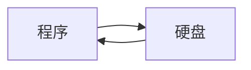
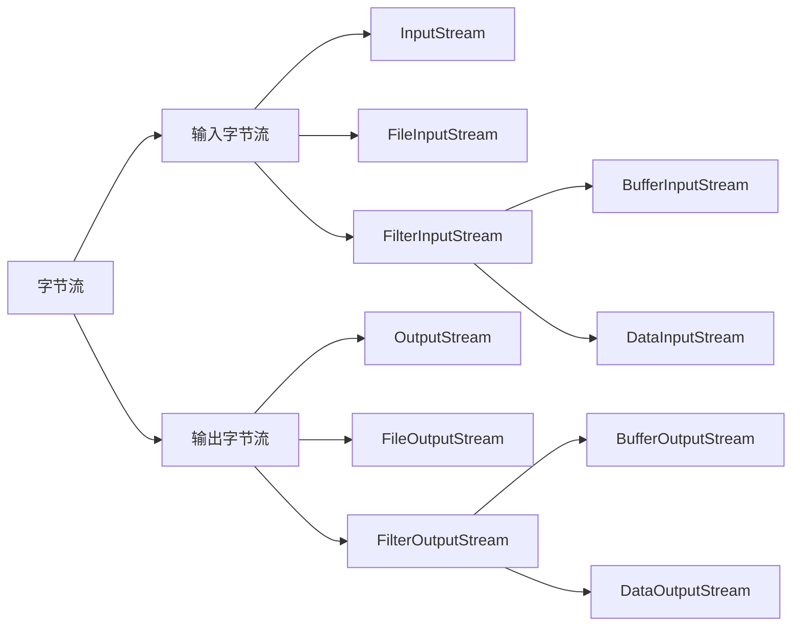
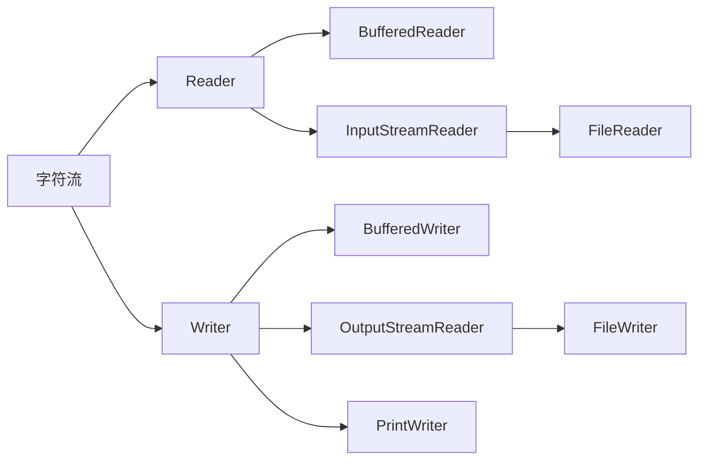

[TOC]

# 字符流与字节流

## 什么是流

- 流是一个抽象概念，是对输入输出设备的抽象，输入流可以看作一个输入管道，输出流可以看作一个输出管道。

- 输入流是相对于程序而言的，从硬盘上传递数据给程序需要借助输入流
- 输出流也是相对于程序而言的，程序需要把数据传递给硬盘需要借助输出流



## 什么是字节流

> 字节流是指传输过程中，传输数据的基本单位是字节的流。
>
> 众所周知，一个字节是8bit，故输出的字节流必须指定编码方式才能正确显现信息。

## 字节流的结构体系




### 输入字节流

> 顾名思义，输入字节流就是将硬盘或者其他存储器中的数据输入到程序中

#### InputStream

> InputStream是抽象基类，所以它不可以创建对象，但它可以用来“接口化编程”，因为大部分子类的函数基类都有定义，所以利用基类来调用函数。

InputStream是字节输入流的抽象基类 ，InputStream作为基类，给它的基类定义了几个通用的函数：

- `read(byte[] b)`：从流中读取b的长度个字节的数据存储到b中，返回结果是读取的字节个数（当再次读时，如果返回-1说明到了结尾，没有了数据）
- `read(byte[] b, int off, int len)`：从流中从off的位置开始读取Len个字节的数据存储到b中，返回结果是实际读取到的字节个数（当再次读时，如果返回-1说明到了结尾，没有了数据）
- `close()`：关闭流，释放资源。

#### FileInputStream

> FileInputStream是用来读文件数据的流，所以它需要一个文件对象用来实例化，这个文件可以是一个File对象,也可以是文件名路径字符串.【这里文件不存在会抛错】
>

FileInputStream主要用来操作文件输入流，它除了可以使用基类定义的函数外,它还实现了基类的read()函数（无参的）：

- `read()`:从流中读取1个字节的数据，返回结果是一个int，（如果编码是以一个字节一个字符的，可以尝试转成char，用来查看数据）。

#### FilterInputStream

> FilterInputStream是一个过滤输入类，其目的是为基础类添加一些功能。我们称之为装饰者模式：
>
> 装饰者模式,就是将原有的基础流进行“装饰”，那么装饰后的方法要与原先被装饰的基础类要保持一致，也可以在对基础流进行扩展。而继承是继承父类的属性和方法，通过重写父类里面的方法也可以起到“装饰”作用，比如强化或者优化父类里面的一些方法。两者的区别是装饰者模式可以动态地扩展一个对象，给对象添加额外的功能。而且装饰者和被装饰者之间不会产生耦合。

而FilterInputStream中最常用的就是BufferInputStream，其作用是减少I/O设备的交互次数，之前不使用缓冲区的时候，每一次`read()`都会进行实际写操作，极大的降低了效率。使用缓冲区后，每次读出的字节首先放在缓冲区中，当积累到一定程度`(缓冲区大小)`的时候在进行写操作

```java
File file = new File("参数")
BufferInputStream bufferInputStream = new BufferInputStream(new FileInputStream(file))
```

FilterInputStream 类要完成两件全然不同的事情。其中，DataInputStream 允许我们读取不同的基本类型数
据以及String 对象（所有方法都以“read”开头，比如`readByte()`，`readFloat()`等等）。**若读取块内的数据，并自己进行解析，就不需要用到DataInputStream。但在其他许多情况下，我们一般都想用它对自己读入的数据进行自动格式化。**

> 要用`DataInputStream` 读取一个文件，这个文件必须是由`DataOutputStream` 写出的，否则会出现`EOFException`，因为`DataOutputStream` 在写出的时候会做一些特殊标记，只有DataInputStream 才能成功的读取。

剩下的类用于修改`InputStream` 的内部行为方式：==是否进行缓冲，是否跟踪自己读入的数据行，以及是否能够推回一个字符==等等。后两种类看起来特别象提供对构建一个编译器的支持（换言之，添加它们为了支持
Java 编译器的构建），所以在常规编程中一般都用不着它们。
也许几乎每次都要缓冲自己的输入，无论连接的是哪个I/O 设备。所以I/O 库最明智的做法就是将未缓冲输入
作为一种特殊情况处理，同时将缓冲输入接纳为标准做法。

**详见【JAVA编程思想】page 536**

### 输出字节流

> 将程序中的数据输出到磁盘中

#### OutputStream

> OutputStream是抽象基类，所以它不能实例化，但它可以用于接口化编程。

`OutputStream`是字节输出流的基类， `OutputStream`作为基类，给它的基类定义了几个通用的函数：

- `write(byte[] b):`将b的长度个字节数据写到输出流中。
- `write(byte[] b,int off,int len):`从b的off位置开始，获取len个字节数据，写到输出流中。
- `flush():`刷新输出流，把数据马上写到输出流中。
- `close():`关闭流，释放系统资源。

#### FileOutputStream

> FileOutputStream是用于写文件的输出流，所以它需要一个文件作为实例化参数，这个文件可以是File对象，也可以是文件路径字符串。【如果文件不存在，那么将自动创建。】【FileOutputStream实例化时可以给第二个参数，第二个参数是是否使用追加写入默认，为true时代表在原有文件内容后面追加写入数据，默认为false】

FileOutputStream是用于写文件的输出流，它除了可以使用基类定义的函数外,还实现了OutputStream的抽象函数write(int b):

- `write(int b):`将b转成一个字节数据，写到输出流中。

#### FilterOutputStream

与**DataInputStream**对应的是**DataOutputStream**，它可以将各种数据类型以及**String**对象格式化输出到“流”中；以便任何机器上的**DataInputStream** 都能正常地读取它们。所有方法都以“wirte”开头，例如**writeByte()，writeFloat()**等等。

## 什么是字符流

> 字符流是指传输过程中的数据单元的基本单位是字符类型。
>
> 这就意味着不需要自己进行编码或解码，因为字符流已经选择好了编码方式（通常根据语言的类型）

## 字符流的结构体系



C++拥有丰富的STL标准模版库，这也是PAT甲级、LeetCode等题⽬中经常需要⽤到的，单纯使⽤C语⾔解决问题会⽐C++的STL解决该问题麻烦很多～