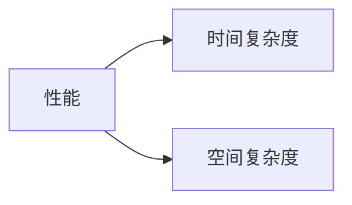

# 排序简介（Algorithms 4th）

> 排序就是将一组对象按照某种逻辑顺序重新排列的过程
>

排序算法的目的是将所有元素的主键按照某种方式排列，也许该元素是一个原始数据类型或者是一个对象。当该元素是一个对象的时候，他必须实现了`Comparable[]`接口，以及实现`compareTo()`方法。下面是书中排序算法类的模板：

```java
public class Example{
    
    /*要求该数组一定实现了Comparable接口*/
    
	public static void sort(Comparable[] a)
    { /*排序算法*/ }
    
    private static boolean less(Comparable v, Comparable w)
    { return v.comparaTo(w) < 0; }
    
    private static void exch(Comparable[] a, int i, int j)
    { Comparable t = a[i]; a[i] = a[j]; a[j] = t;}
    
    private static void show(Comparable[] a)
    {
        for(int i = 0; i < a.length; i++)
            StdOut.print(a[i]+" ");
        StdOut.println();
    }
    
    public static boolean isSorted(Comparable[] a)
    {
        for(int i = 1; i < a.length; i++)
            if(less(a[i],a[i-1]))
                return false;
        return true;
    }
    
    public static void main(String[] args)
    {
        String[] a = In.readStrings();
        sort(a);
        assert isSortes(a);
        show(a);
    }
}
```

## 排序性能

性能要从两个方面进行考虑：==时间复杂度==与==空间复杂度==。



> 在研究排序算法时，我们需要计算**比较**和**交换**的数量，对于不交换元素的算法，我们会计算访问数组的次数

