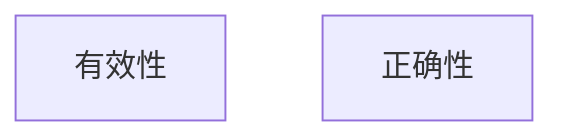
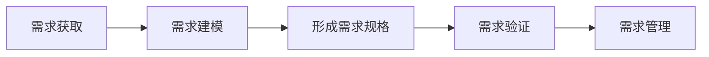
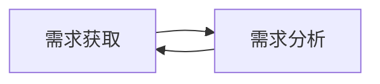

[TOC]

#### 任务描述

本关任务：根据所学有关需求工程的知识，完成相关的选择题。

#### 相关知识

为了完成本关任务，你需要掌握：

- [ ] 需求工程的基本概念，

- [ ] 需求工程的内容以及方法。

##### 需求工程

==需求工程是指应用已证实有效的原理、方法，通过合适的工具和记号，系统地描述待开发系统及其行为特征和相关约束。==

需求工程覆盖了体系结构设计之前的各项开发活动，主要包括==分析客户要求==、==对未来系统的各项功能性==及==非功能性需求进行规格说明==，并针对不同的对象可分为**系统需求工程**（如果是针对由软硬件共同组成的整个系统）和**软件需求工程**（如果仅是专门针对纯软件部分）。

在系统开发中，==需求工程往往与体系结构设计交替进行==，直到分解的子问题可以单纯地由软件或硬件系统解决。软件需求工程则是对应用于纯软件系统开发生命期中系统设计之前的第一阶段。

因此，需求工程的目标相当简单明了：==**确定客户需求，定义设想中系统的所有外部特征。**==

###### 需求工程的方法

需求工程是一个不断反复的==需求定义、文档记录、需求演进==的过程，并最终在验证的基础上完成需求规范。

为了提高目标软件需求规格的质量，需求工程提出了以下几种方法：

- ==结构化需求抽取方法==

需求工程支持结构化的需求抽取过程，为需求的抽取过程提供构型未来系统的理念，提供需求抽取的线索、需求描述的框架和需求抽取方法论，明确指出需求抽取过程中所涉及的有关问题及其正确的处理方法，从而保证抽取过程的质量，并提供系统化、工程化的指南和有效的支持工具，使得需求信息的无二义性、完整性和一致性。

- ==系统化的需求建模方法==

需求工程支持系统化的需求建模过程和途径，为软件需求模型提供预定义的语义解释和预定义的语义约束，支持需求提供者和系统开发者从语义上正确地理解所获得需求信息的含义，使得需求提供者可以正确地判断当前已提供的需求信息是否真正表达了他们自己的意图，也使得系统开发者可以了解自己对需求提供者所提供需求信息的理解程度。

- ==形式化的需求验证技术==

形式化的验证技术是在形式化需求模型基础之上进一步保证需求信息正确性的手段。 它采用精确的数学语言来表达需求模型，并借助于数学推导的手段, 使得需求模型中含糊的、不完整的、矛盾的以及无法实现的表述能够被准确地发现, 从而尽早得到纠正。

形式化需求验证技术一般分为3类，分别是==代数方法、基于模型的方法和基于进程代数的方法==，它们分别适用于描述和分析不同类型的软件系统。

形式化需求验证技术的作用分为两个方面: 一方面是==验证需求提供者的意图可满足性== (即需求模型的有效性)；另一方面是==验证需求模型的可实现性== (即需求模型的正确性)，这一点使得形式化需求验证技术和一般的形式化方法得以区别开来。

形式化需求验证的意义在于：如果方法被正确使用的话，对于特定的语义是有充分定义的。

###### 需求工程的阶段

综合了几种观点，可以把需求工程的活动划分为以下5个独立的阶段：

1. 需求获取

通过与用户的交流，对现有系统的观察及对任务进行分析，从而开发、捕获和修订用户的需求；

2. 需求建模

为最终用户所看到的系统建立一个概念模型，作为对需求的抽象描述，并尽可能多的捕获现实世界的语义；

3. 形成需求规格

生成需求模型构件的精确的形式化的描述，作为用户和开发者之间的一个协约；

4. 需求验证

以需求规格说明为输入，通过符号执行、模拟或快速原型等途径，分析需求规格的正确性和可行性，包含有效性检查，一致性检查，可行性检查和确认可验证性；

5. 需求管理

支持系统的需求演进，如需求变化和可跟踪性问题。

###### 需求工程的内容

- 需求获取阶段

需求获取首先需要的是技术的支持，其次，在需求获取工作中主要涉及了3个至关重要的因素：==应搜集什么信息；从什么来源中搜集信息；用什么机制或技术搜集信息。==

再次，需求获取的开始，代表着软件项目正式开始实施，正所谓万事开头难。综合上述3个点使得需求获取成为软件开发中最困难、最关键、最易出错也是最需要交流的方面。

在工作开展中，主要是就业务流程、组织架构、软硬件环境和现有系统等相关内容进行沟通，==挖掘系统最终用户的真正需求，把握需求的方向。==在需求获取调研会中首先对需求获取方法作了验证。现行的需求获取方法一般有基于调查的需求获取方法、基于用例的需求获取方法、原型法等几种方法。各种需求获取方法各有利弊。

- 需求分析阶段

==需求分析与需求获取是密切相关的，需求获取是需求分析的基础，需求分析是需求获取的直接表现，两者相互促进，相互制约。==

需求分析与需求获取的不同主要在于需求分析是在已经了解承建方的实际的客观的较全面的业务及相关信息的基础上，结合软、硬件实现方案，并做出初步的系统原型给承建方做演示。承建方则通过原型演示来体验业务流程的合理化、准确性、易用性。同时，用户还要通过原型演示及时地发现并提出其中存在的问题和改进意见和方法。

- 文档编写阶段

需求开发的最终成果是，在对所要开发的产品达成共识后，所编写的具体的文档。需求文档是在需求获取和需求分析两个阶段任务结束时生成的，所以文档要包含所有需求。

在此阶段先要从软件工程和文档管理的角度出发依据相关的标准审核需求文档内容，确定需求文档内容是否完整。对需求文档中存留问题进行修改的工作。

- 需求确认阶段

需求确认主要是针对《需求规格说明书》的评审，保证需求符合优秀需求成熟的特征，并且符合好的需求规格说明的特征。

在需求确认阶段需要保证以下几点：

① 软件需求规格说明正确描述了预期的满足各方涉众需求的系统能力和特征；

② 从系统需求、业务规则或其他来源中正确的推导出软件需求；

③ 需求是完整的、高质量的；

④ 需求的表示在所有地方都是一致的；

⑤ 需求为继续进行产品设计和构造提供充分的基础。

- 需求跟踪阶段

需求跟踪是指通过比较需求文档与后续工作成果之间的对应关系，确保产品依据需求文档进行开发，建立与维护“需求——设计——编程——测试”之间的一致性，确保所有工作成果符合用户需求。

需求跟踪是一项需要进行大量手工劳动的任务，在系统开发和维护的过程中一定要随时对跟踪联系链信息进行更新。需求跟踪能力的好坏会直接影响产品质量，降低维护成本，容易实现复用，同时，需求跟踪还需要建设方的大力支持。

- 需求复用阶段

在软件项目实施过程中，许多不同项目间存在着许多相似的需求，尤其是类型相同的项目在不同的用户群众的实施中，需求的相似性就更加明显、更加普遍了。

有了需求复用，建设方就能快速的形成一个需求的原型，这样，后期的需求工作只需要在此原型的基础上进行修改、扩充和完善即可，大大提高了需求分析的工作进度。所以，对于需求的复用就需要加以重视。

对于需求复用，首要责任就是要提取可复用的需求，对需求复用的理解和扩充。其次就是要保证需求复用不存在冲突。

- 变更控制阶段

需求变更在软件项目开发中是不可避免的。无休止的需求变更只会造成各种资源无休止的浪费，但是其中也不乏有许多是必要的、合理的需求变更。

对于需求变更，首先是要尽量及早的发现，以避免更大的损失。其次，是要采取相应的、合理的变更管理制度和流程，这样同样可以降低需求变更带来的风险。

- 版本控制阶段

版本控制是管理需求规格说明和其他项目文档必不可少的一个方面，也是需求变更文档化管理的最有效办法。可以详细记录发生需求变更的需求文档版本的版本，发生变更的原因，变更发生的控制记录，并对变更后的需求文档进行唯一版本号的标识。使得每个成员都能及时访问最新版本的需求文档。

实施版本控制的基础是需求基线，所谓需求基线就是项目组成员一经承诺将在某一特定产品版本中实现的功能性和非功能性需求的集合。需求基线的确定可以保证项目的涉众各方可以对发布的产品中希望具有的功能和属性有一个一致的理解。